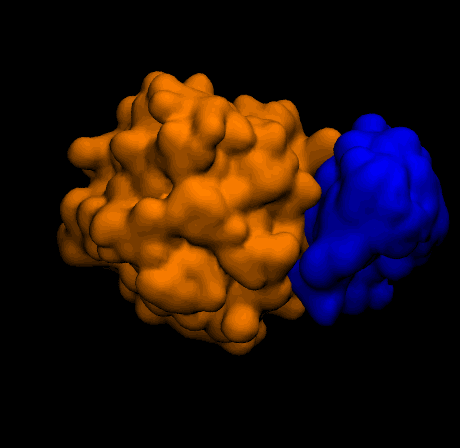

# MC Protein Docking

Course project code and inputs for Monte Carlo protein docking (AMS 548).

## Requirements

- macOS or Linux terminal environment
- `gcc` and `make` (to build `nummod`)
- Python 3 (to generate plots)
- Python packages: `matplotlib`, `prettypyplot`

You can comment out prettypyplot if you don't want to install it. 

## Run Inputs

- Parameter file: `prm/atom.prm`
- Receptor: `data/rec.ms`
- Ligand: `data/lig.ms`

## Build

```bash
cd nummod-jlguerra
make clean
make
```

## Run

```bash
cd nummod-jlguerra
./nummod -p ../prm/atom.prm ../data/rec.ms ../data/lig.ms
```

## Outputs

- `distance_vs_e_energy.dat`
- `dock_energy_mc.dat`
- `montecarlo*.ms` (accepted docking poses)
- `translation/` files from the CoM translation test

## Docking Trajectory GIF

[View full GIF](mc_protein_docking.gif)


